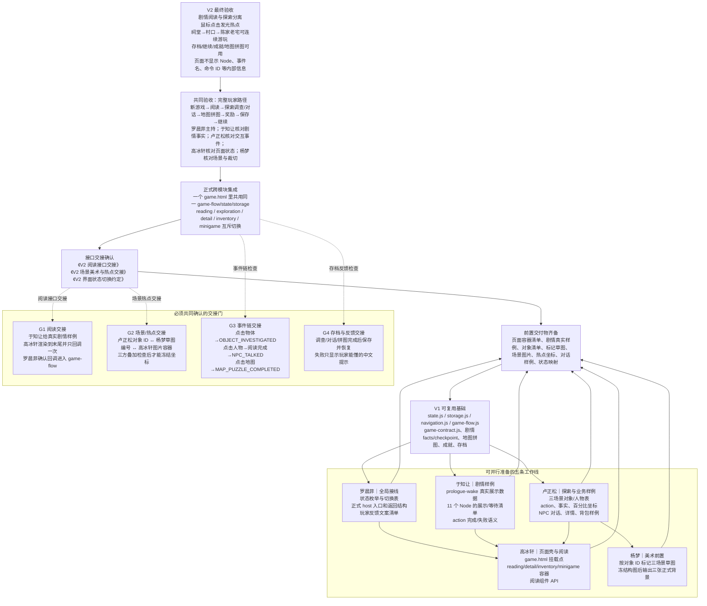
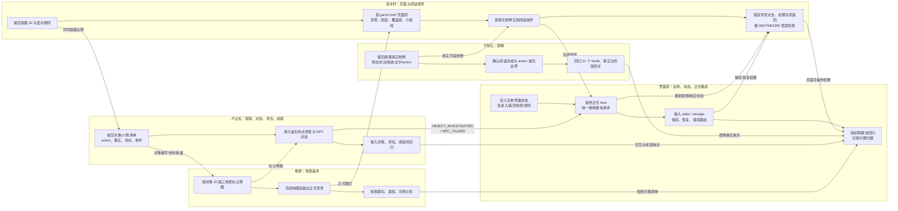

# 《借灯》V2 开发流程图

这张图按依赖关系阅读，不按日期阅读。图的上方是最终要交付的玩家体验，向下倒推必须先准备的接口、素材和 V1 基础；实际开发从下往上推进。

## 1. 总体依赖图

图中关系的含义：

- **先做**：在 V1 基础之上，先产出真实样例、对象清单、页面容器和场景草图；没有这些输入，接入方不得自行猜字段或坐标。
- **可并行**：罗晨菲整理全局接线，高冰轩搭页面壳，于知让整理剧情，卢正松整理探索对象，杨梦根据对象清单画标记草图。这些工作互相提供小型输入，但不需要等到所有代码完成才开始。
- **必须等待**：热点坐标要等“对象清单 + 标记草图 + 实际图片容器比例”三者对齐；阅读组件要等剧情样例和 NPC 对话样例；正式集成要等页面容器、阅读组件、探索模块和场景图都能挂载。
- **共同验证**：每个交接门都由提供方给真实输入，使用方在正式 `game.html` 点击验证，再由罗晨菲确认事件是否经过 `game-flow → state → storage`。

## 2. 五人协作泳道

## 3. 每个交接点要交什么、谁来确认

| 交接点 | 提供方 → 使用方 | 必须确认的具体内容 | 通过标准 |
|---|---|---|---|
| 阅读样例 | 于知让 → 高冰轩、罗晨菲 | 文本块类型、说话人、顺序、action ID、结束/等待含义 | 高冰轩能逐段显示；末尾只回调一次；罗晨菲收到合法 action |
| NPC 对话 | 卢正松 → 高冰轩、罗晨菲、于知让 | `conversationId/npcId`、对白段落、完成/取消事件 | 完成前不提交 `NPC_TALKED`；完成后事实和 Node 均正确 |
| 场景对象 | 卢正松 → 杨梦、高冰轩 | 对象/人物 ID、名称、出现条件、必需性、百分比坐标 | 草图编号、代码坐标、图片对象一一对应 |
| 场景图片 | 杨梦 → 高冰轩、卢正松 | 文件路径、尺寸/比例、对象位置、文字安全区 | 图片替换后热点仍命中原对象，无关键遮挡 |
| 界面状态 | 罗晨菲 → 高冰轩、于知让、卢正松 | 进入、取消、失败、完成、返回目标；覆盖层打开时禁止背景点击 | 任一入口只显示一个主状态；关闭后回到正确状态 |
| 保存恢复 | 罗晨菲 → 全体 | 保存前后 `storyCheckpoint/facts`、坏档/无档提示 | 刷新或继续游戏后页面、事实、检查点一致；失败不伪装成新游戏 |
| 最终验收 | 罗晨菲主持 → 全体 | 同一点击路径的页面、事件、事实、存档、视觉结果 | 三阶段路径可通关；所有问题有唯一归属并完成复测 |

## 4. 当前版本到 V2 的倒推关系

- **现在已有**：V1 的状态、存档、事件合同、剧情检查点、地图拼图和成就基础，作为最底层依赖保留。
- **先补齐输入**：剧情真实展示样例、NPC 对话样例、三场景对象清单、对象编号草图、页面容器 ID 和界面状态表。
- **再做模块实现**：高冰轩实现页面壳与阅读组件；卢正松实现点击热点及业务视图；杨梦完成正式场景图；于知让完成剧情回调适配；罗晨菲提供统一 host 并接线。
- **最后做共同联调**：沿“点击热点/人物/地图 → 页面状态 → 外部事件 → 剧情响应 → 保存恢复”的同一条链验证，直到 V2 最终验收条件全部满足。

相关任务卡详见 [项目需求文档v2.md](./项目需求文档v2.md)。
