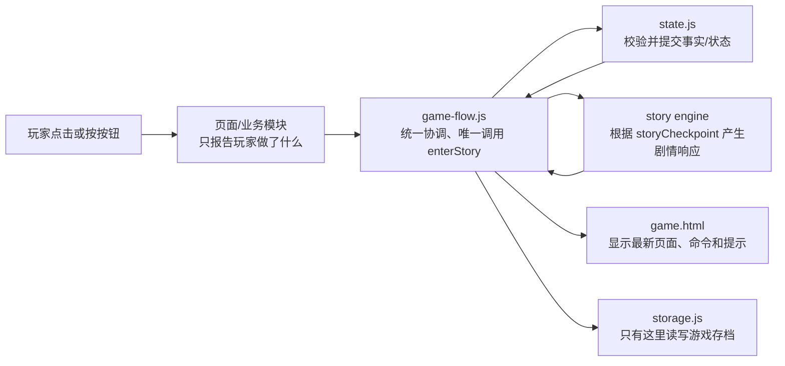
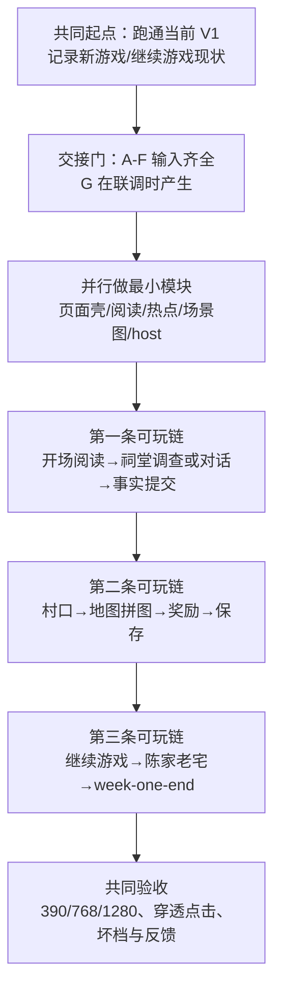
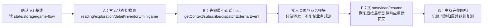
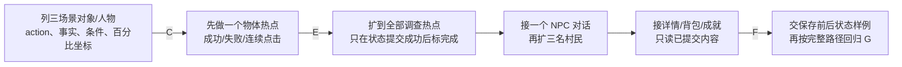
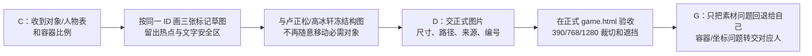

# 《借灯》V2 开发执行路线（按人可执行版）

> 这份文档是开发入口，不是接口百科。先按路线图做，再回看《项目需求文档v2.md》的详细字段和验收规则。

## 0. 先用一句话说清楚 V2 要做什么

玩家在一个正式 `pages/game.html` 里，按“阅读剧情 → 点击场景热点调查/和人物对话 → 完成地图拼图 → 获得奖励 → 保存并继续”的顺序，从祠堂玩到村口，再玩到陈家老宅；五种界面不能同时抢点击，剧情进度仍只认 `storyCheckpoint`。

V2 不做：新剧情阶段、新小游戏、多结局、配音、人物自由移动、自动寻路、拼图中途布局恢复。

## 1. 所有人今天先做的第一步（不要直接开写功能）

1. 在当前 `feature_global` 工作区启动服务器：`py -m http.server 8000`。
2. 打开 `http://127.0.0.1:8000/pages/menu.html`，分别试一次“新游戏”和“继续游戏”，记录当前能看到的页面、报错和无法点击的地方。
3. 只阅读本路线中自己的泳道，再阅读原需求文档中对应章节；不先通读所有 G/U/S/E/A 编号。
4. 先交出本路线要求的“第一份交接物”，使用方确认字段后再写实现；缺字段退回提供方，不在调用处猜默认值。
5. 每次交接都在正式 `pages/game.html` 验证一次成功、一次取消或失败、一次连续点击；模块内部检查使用测试夹具，不作为正式页面验收。

### 1.1 五个人都必须理解的全局调用链



记住四条边界：

- 探索、对话、小游戏只报告结果，不决定下一个 Node。
- 只有 `game-flow.js` 调用 `enterStory()`，只有 `state.js` 提交状态。
- 只有 `storage.js` 读写游戏存档；业务模块不能直接碰 `localStorage`。
- 页面只显示提交成功的状态；内部的 Node、事件名、命令 ID、错误码只进控制台。

## 2. 总路线：先交接口，再做模块，最后走一条完整玩家路径



### 2.1 交接字母表

| 字母 | 提供方 → 使用方 | 必须交出的东西 | 使用方的通过标准 |
|---|---|---|---|
| A | 高冰轩 → 罗晨菲、卢正松 | 五个容器 ID、显示/隐藏规则、覆盖层返回规则 | 能按真实 ID 切换，隐藏层不占位、不接收点击 |
| B | 于知让 → 高冰轩、罗晨菲 | `prologue-wake` 真实剧情样例、11 个 Node 展示/等待清单 | 能逐段显示；末尾只回调一次；action 不被当成“下一段” |
| C | 卢正松 → 杨梦、高冰轩 | 三场景对象/人物 ID、名称、条件、action/事实、百分比坐标 | 草图、代码热点、页面对象使用同一 ID |
| D | 杨梦 → 高冰轩、卢正松 | 标记草图、冻结构图、三张正式背景及尺寸/路径 | 替换图片后热点仍命中正确物体，关键对象不被文字遮住 |
| E | 罗晨菲 → 高冰轩、卢正松 | 正式 host 的入口、输入、返回结构、订阅清理方式 | 点击结果都经过 `game-flow → state`，失败不伪造成功 |
| F | 于知让、卢正松 → 罗晨菲 | 阅读/调查/地图完成前后的状态和检查点样例 | `save/load/resume` 后 `storyCheckpoint`、事实和页面一致 |
| G | 全体 → 罗晨菲 | 同一点击路径的复现、预期、实际、截图/控制台结果 | 每个问题只有一个修复归属，修复后原报告人复测关闭 |

---

## 3. 罗晨菲｜全局、状态与正式集成

### 3.1 最小可行路线



### 3.2 每一步做什么、交什么

| 步骤 | 具体动作 | 交付物 | 完成判据 |
|---|---|---|---|
| R0 | 用控制台确认当前 `gameFlow`、`state`、`storage` 能启动；记录现状，不先改剧情 | V1 基线记录 | 新游戏和继续游戏各有一条可复现记录 |
| R1 | 写出五种界面的进入、完成、取消、失败、返回目标；规定覆盖层锁背景 | 《V2 界面状态切换约定》初稿 | 高冰轩能据此给出每个容器 ID；没有“按按钮文案猜 Node” |
| R2 | 在 `game-flow.js/navigation.js` 提供 host 骨架和统一转发；保留完整 `commands` | host 入口/返回样例 | 卢正松可提交一次真实事件；失败返回 `{ok:false,...}` |
| R3 | 按“账户/存档恢复 → 挂载模块 → 发布命令 → 通知页面”的顺序接正式 `game.html` | 正式挂载/卸载代码 | 页面只生成一份模块 DOM；卸载后订阅被清理 |
| R4 | 接 `saveGame/loadGame/resumeGame`；区分无档、坏档、版本不兼容、存储不可用 | 四类存档结果记录 | 失败不变成新游戏；恢复后 `storyCheckpoint` 与页面一致 |
| R5 | 用一张表记录入口、预期页面、预期事实、存档结果、实际结果 | 联调清单和问题单 | 三阶段走通；每个问题有唯一负责人且由报告人复测 |

### 3.3 只负责 / 不负责

- 只负责：`assets/js/core/navigation.js`、`game-flow.js`、必要的全局状态接口、正式组装、存档接线和问题归属。
- 不负责：剧情文本、热点坐标、NPC 对话、拼图规则、场景美术。
- 最小完成线：能让别人把模块接进同一个 host，并能从新游戏走到保存/继续；不要先重写 V1 全局。

---

## 4. 高冰轩｜游戏页面与统一阅读组件

### 4.1 最小可行路线


### 4.2 每一步做什么、交什么

| 步骤 | 具体动作 | 交付物 | 完成判据 |
|---|---|---|---|
| H0 | 打开正式 `pages/game.html`，标出现有场景、剧情、操作、背包、小游戏和反馈位置 | 页面现状图 | 全员知道哪些是正式容器、哪些是 demo 容器 |
| H1 | 重搭页面分层：场景、阅读、详情、背包、小游戏、导航/反馈；固定挂载点 | `pages/game.html` 和 CSS 结构、A | 只显示一个主状态；隐藏层不占位、不接收点击 |
| H2 | 按 B 样例逐段显示旁白/系统/人物对白；继续只推进阅读索引，末尾才回调 | 阅读组件 API 和调用样例 | 连点不会重复提交；缺字段直接报字段名，不自填剧情 |
| H3 | 详情/背包/小游戏打开时锁背景；关闭后回到打开前状态和焦点 | 覆盖层与返回处理 | “详情打开—关闭—原热点仍可点”“地图取消—回探索”均通过 |
| H4 | 接 D 场景图；统一容器缩放、热点点击区、文字安全区；失败保留文字返回入口 | 三视口检查记录 | 390、768、1280 内容区域不横溢；关键对象和按钮可见 |
| H5 | 在正式 URL 清除 Node、事件名、命令 ID、日志等页面显示 | 页面反馈清理记录 | 玩家只看到故事和下一步提示，技术字段只在控制台 |

### 4.3 只负责 / 不负责

- 只负责：`pages/game.html`、游戏页样式、统一阅读组件和覆盖层。
- 不负责：`navigation.js`、剧情推进、探索事实、热点坐标、场景图片内容。
- 最小完成线：页面能承载五种状态，阅读和弹层不穿透，三种宽度能点；先不要做额外动画和复杂键盘操作。

---

## 5. 于知让｜剧情展示与剧情回归

### 5.1 最小可行路线


### 5.2 每一步做什么、交什么

| 步骤 | 具体动作 | 交付物 | 完成判据 |
|---|---|---|---|
| Y0 | 用 `story-registry.js` 和三阶段数据列出 11 个 Node 的顺序、里程碑和外部等待点 | Node 清单 | 每个外部任务都有“谁触发、完成产生什么事实” |
| Y1 | 先交 `prologue-wake` 真实样例，再补覆盖不同块类型的样例 | B、字段说明 | 高冰轩可直接渲染；不需要调用方猜文本类型或 action ID |
| Y2 | 与阅读组件逐段点击，明确何时停在阅读、何时把控制权交给探索/对话/地图 | 阅读边界确认 | 连点“继续”只翻段；没有 action 时不提交剧情 |
| Y3 | 适配现有 `handleStoryAction(actionId)`；只提交剧情登记的 action | 剧情回调适配 | 成功才换 Node；失败时页面仍停在旧内容 |
| Y4 | 选出阅读保存、等待对话保存、调查后保存、地图完成后保存的前后状态 | F 检查点样例 | 罗晨菲可据此断言恢复的 `storyCheckpoint/facts` |
| Y5 | 从开场到 `week-one-end` 顺序回归；问题写“预期事实/实际事件/页面表现” | 剧情回归记录 | 不直接改他人模块，不把页面问题写成剧情问题 |

### 5.3 只负责 / 不负责

- 只负责：`assets/js/game-line` 剧情数据与展示适配、Node 顺序和剧情事实核对。
- 不负责：NPC 具体对白、页面 DOM、探索事实生产、界面状态切换。
- 最小完成线：一段真实剧情能正确显示和提交，11 个 Node 有可执行回归清单；先不要扩写新剧情。

---

## 6. 卢正松｜点击式探索、NPC 对话、背包与成就

### 6.1 最小可行路线



### 6.2 每一步做什么、交什么

| 步骤 | 具体动作 | 交付物 | 完成判据 |
|---|---|---|---|
| L0 | 为 shrine/village/old-house 列对象和人物 ID、玩家名称、显示条件、动作结果、事实和百分比坐标；删掉移动/距离门槛 | 三场景对象表、C | 每个必需对象在剧情清单和场景图中都有同一 ID |
| L1 | 先只跑通一个物体调查：点击 → 事件 → 状态提交 → 热点变已调查 | 单热点验证记录 | 成功一次、失败一次、连续点击一次；失败不显示完成 |
| L2 | 扩展全部热点；已完成热点可回读但不重复产生事实 | 探索视图和测试结果 | `OBJECT_INVESTIGATED` 带完整字段，事件不携带下一 Node |
| L3 | 把人物对白交给统一阅读组件；读完才提交 `NPC_TALKED`，取消/失败走对应事件 | 一份真实对话样例、适配器 | 三名村民都能完成；完成前不提前记事实 |
| L4 | 调查结果打开详情；背包按物品/线索只读；地图完成后按已提交事实显示成就 | 详情/背包/成就回归 | 关闭后回原状态；坏档不冒充“初始锁定列表” |
| L5 | 与罗晨菲、高冰轩共同走调查、对话、地图、继续游戏 | F、G | 所有交互问题能按“探索/页面/全局/剧情”归属 |

### 6.3 只负责 / 不负责

- 只负责：`assets/js/exploration`、`assets/js/achievements` 及对应样式、交互适配。
- 不负责：剧情 Node、全局状态、正式存档、`game.html` 结构、场景图片内容。
- 最小完成线：一个物体、一个人物、一个地图入口先跑通，再复制到全量；不要一开始同时改四类业务。

---

## 7. 杨梦｜场景美术与视觉验收

### 7.1 最小可行路线



### 7.2 每一步做什么、交什么

| 步骤 | 具体动作 | 交付物 | 完成判据 |
|---|---|---|---|
| M0 | 对照 C 表确认每个必需对象、人物、地图入口和文字安全区 | 对象确认记录 | 不出现“代码有热点但图中没有物体” |
| M1 | 先画低清标记草图，用同一对象 ID 标位置、大小和可点击空白区 | 三张标记草图 | 卢正松可录百分比坐标，高冰轩可在真实容器加载 |
| M2 | 三方确认构图和裁切规则后冻结；后续图片替换不改对象位置 | 冻结版草图 | 任何变更都有明确原因和重新确认人 |
| M3 | 输出祠堂、村口、老宅正式图及路径/尺寸/来源；保持冻结对象位置 | D、三张正式背景 | 替换后热点仍命中；阅读区不遮住关键线索 |
| M4 | 在三种内容区域宽度截图，标出裁切、对比度、遮挡和风格问题 | 视觉检查记录 | 只把素材问题交给自己，布局给高冰轩，坐标给卢正松 |

### 7.3 只负责 / 不负责

- 只负责：三张场景背景、构图、视觉规范和素材验收。
- 不负责：热点坐标、业务状态、剧情内容、页面切换代码。
- 最小完成线：先保证必需对象“看得见、点得到、不会被文字遮住”；不先追求复杂特效。

---

## 8. 三个必须卡住返工的交接门

### 交接门一：输入齐全（才能开始正式实现）

- A 页面容器清单；B 剧情样例；C 对象/热点表；D 标记草图；E host 输入输出。
- 缺任何一项，使用方只写接口确认或最小骨架，不猜字段、不批量接入。

### 交接门二：第一条可玩链（才能扩展全量）

先只跑通：

`prologue-wake 阅读 → 一个物体调查 → OBJECT_INVESTIGATED → state 提交 → 最新剧情响应 → 页面反馈`

通过条件：成功、失败、连续点击各一次；热点只在状态提交成功后变完成。

### 交接门三：保存与继续（才能宣布 V2 完成）

至少验证：阅读中保存、调查后保存、地图完成后保存、继续游戏恢复、坏档/无档/版本不兼容/存储不可用。恢复失败时保留原数据和返回路径，不能伪装成“新游戏初始状态”。

## 9. 每次提交都要附的最小记录

```text
入口：从哪里开始、点了什么
预期页面：应该显示哪一种界面
预期事件/事实：玩家动作应该产生什么结果
预期存档：是否应改变 storyCheckpoint/facts
实际结果：页面、控制台、存档分别发生了什么
归属：页面 / 剧情 / 探索对话背包成就 / 美术 / 全局存档
复测：修复后由原报告人沿同一路径再次确认
```

## 10. 什么时候可以说“V2 做完了”

- [ ] 五种界面互斥；详情、背包、小游戏打开时背景不能穿透点击。
- [ ] 统一阅读组件能显示剧情和 NPC 对话，末尾只回调一次。
- [ ] 祠堂、村口、陈家老宅可连续游玩，调查、对话、地图拼图和奖励链条完整。
- [ ] 所有剧情推进都经过 `storyCheckpoint → game-flow → state`，没有模块自行改 Node。
- [ ] 新游戏、保存、继续游戏、坏档和无档结果可区分，失败不清空或伪造状态。
- [ ] 390、768、1280 内容区域无横向溢出，场景、热点、文字和按钮都可见可点。
- [ ] 正式页面没有 Node、事件名、命令 ID、事实 ID、错误码、函数名和调用栈等内部信息。
- [ ] 每个阻断问题都有负责人，并由报告人按原路径复测关闭。

相关详细规格： [《项目需求文档v2》](./项目需求文档v2.md)；现有依赖总图： [《V2开发流程图》](./V2开发流程图.md)。
