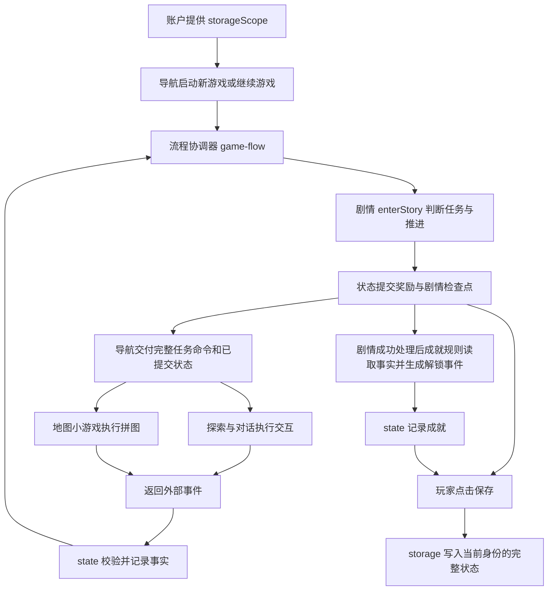

# V1 全局与存档板块进度汇报

核对日期：2026-09-06（用户所在时区）。代码基准：本地 `feature_global`，提交 `a74a32b`。未核验远程最新分支、合并状态或版本标签。

依据：`docs/项目文档v1.md`、`docs/需求文档v1.md`、剧情/探索/成就/账户交接文档，以及当前正式代码。未采用 `docs/re-consider`。本次上下文未提供额外附件内容，因此这里以仓库内上述两份 V1 文档为项目与需求基准。

**结论：全局已经完成 V1 的主要运行骨架，正式代码可以贯通三阶段剧情、探索、对话、地图结果、成就记录和保存恢复；目前处于主链完成后的接口文档同步、异常处理和界面验收阶段。**

## 1. 进度应怎样汇报

| 统计范围 | 建议口径 | 依据与限制 |
| --- | --- | --- |
| 全局状态、流程协调、单存档核心 | 约 85%—90% | 正式代码主链及多个保存恢复点已验证，模块细节恢复、错误恢复和接口收口仍有余项 |
| 个人承担的全部 V1 需求：R05、R06、R11、R14、R15、R20、R21 | 约 75%—85%，汇报可取约 80% | 还包含全站导航、响应式、多媒体、成功/失败反馈，不能只按五个 JS 文件计完成 |
| V1 主线覆盖 | 已贯通规划的 3 个阶段、11 个运行节点 | 验证终点为 `week-one-end`，不等同于全部产品验收通过 |
| 完整故事内容 | 按需求文档口径为 3/14，约 21.4% | 这是故事阶段覆盖率，不是全局代码完成率或整个项目工时完成率 |
| 完整三周项目的全局系统 | 已建成支持 V1 的基础框架，暂不报精确百分比 | 后续证据删改、多结局及第二小游戏的具体需求尚未全部细化，无法合理计算剩余工作量 |

前两项为审阅后的工程估计，不是测试通过率、逐条验收通过率或精确工时统计。核心流程完成度较高，但已确认的缺口意味着目前不宜报告“全部完成 100%”。

项目文档对版本完成还要求互审、需求验收、合并和版本标签；本次代码核查不能替代这些团队流程。

## 2. 本版本实际完成了什么

| 文件 | 负责的工作 | 汇报时可以怎么说 |
| --- | --- | --- |
| `assets/js/core/game-contract.js` | 分类登记外部事件、剧情状态事件、通知、应用事件，以及 V1 的 30 个事实与唯一生产者 | 建立模块之间统一的数据约定，减少事件名称和事实来源不一致 |
| `assets/js/core/state.js` | 创建初始状态；校验外部事件来源及关联命令；记录事实；提交剧情奖励与检查点；防止重复处理 | 建立统一游戏状态和集中更新入口，让剧情位置、物品、线索与完成结果保持一致 |
| `assets/js/core/storage.js` | 按游客/账户隔离存档；保存完整状态；读取、结构校验、版本检查和错误结果 | 实现本地单存档的保存与恢复，避免串档、坏档直接进入游戏和写入失败后假报成功 |
| `assets/js/core/game-flow.js` | 调用剧情唯一入口；组织新游戏、恢复、剧情操作、外部事件；提交响应后分发命令、通知与展示 | 实现流程协调器，把各模块的结果转成可继续运行的完整游戏流程 |
| `assets/js/core/navigation.js` | 账户会话、主菜单、新游戏/继续、保存按钮、返回菜单；创建探索宿主、挂载探索及地图适配器；提交成就事件 | 完成页面启动与跨模块接入，让独立功能在正式页面共同运行 |
| `pages/game.html`、`assets/js/core/game-ui.js` | 提供场景、探索操作、背包、小游戏及剧情的挂载区域；显示已提交状态、剧情内容和操作 | 借助 AI 搭建用于联调的游戏页面和基础展示层，验证完整流程；界面仍需完善 |

这部分贡献包括接口适配、运行时组装和联调验证。探索玩法、对白内容、拼图规则和剧情引擎仍应归属对应模块负责人；可以报告“完成这些模块的正式集成”，不应将队友模块整体算作个人开发成果。

根据剧情交接文档完成的关键升级：

1. 增加 `facts`，用稳定事实表示已经发生的调查、对话和事件。
2. 增加 `storyCheckpoint`，保存当前节点、节点语义版本、已完成里程碑/节点/阶段及待处理命令。
3. 增加请求 ID、外部事件 ID 和奖励 `onceKey` 的去重记录。
4. 将剧情检查点和奖励作为同一次剧情事务提交；事务失败时不发布新剧情展示或成功通知。
5. 读档后真正调用剧情的 `resume`，由剧情重新生成当前展示及原任务命令。
6. 更新初始物品、钥匙来源和线索分类，符合新的剧情约定。

注意：外部事实先提交，之后才调用剧情并提交剧情事务。因此“剧情事务原子提交”不代表外部事实与后续所有页面副作用也一起回滚。

## 3. 各模块到底怎样交接

可以把三种数据理解为：**命令说明现在要做什么，事件说明玩家做了什么，事实说明哪些结果已经被系统记住。**



### 与账户、剧情、成就的交接

| 对方 | 对方向全局提供 | 全局负责 | 对方保留的责任 |
| --- | --- | --- | --- |
| 账户（于知让） | `WhiteLamp.auth.getSession()` 返回的 `storageScope` | 等待身份确定后建档/读档，再挂载业务模块 | 注册、登录、密码摘要及会话管理 |
| 剧情（于知让） | `enterStory(request)` 的检查点、奖励事件、命令、通知、展示 | 提交外部事实，调用引擎，提交剧情响应，向页面和模块发布结果 | 剧情内容、任务条件、奖励规则、下一节点和终点判断 |
| 成就（卢正松） | `getAchievementEvents({state})` 的待提交解锁事件 | 调用规则、把事件提交给状态、随游戏存档保存 | 解锁条件、成就名称说明和成就视图 |

### 与 exploration 的交接

当前 `exploration` 目录包含三个需要区分的职责：物体调查与背包、`conversation` 对话子模块、`integration` 页面组合适配器。它们可以显示在同一个场景里，但事件来源不同。

你在 `navigation.js` 中提供的宿主对象，是双方真正的接口：

| 接口 | 给对方什么 | 用途 |
| --- | --- | --- |
| `host.getContext()` | 当前 `storageScope`、已提交 `state`、完整 `commands` | 确认当前节点允许哪些调查/谈话，哪些物品已经获得 |
| `host.subscribe(listener)` | 状态更新通知和取消订阅函数 | 状态改变后重画场景、热点与背包 |
| `host.dispatchExternalEvent(event)` | 将事件交回协调器，异步返回处理结果 | 校验、记录事实，再重新判断剧情 |

`createInteractionModule(host)` 组合调查与对话，`mountExploration(...)` 把它挂到游戏页面。全局负责提供宿主和容器，探索模块负责具体热点、移动、调查反馈、对白阅读与确认、背包展示。

以调查工作证为例：

1. 剧情发出 `REQUEST_EXPLORATION`，要求调查当前物品。
2. 全局把完整命令交给探索模块。
3. 玩家调查工作证，探索发出 `OBJECT_INVESTIGATED`，来源为 `exploration`，带回原 `commandId` 和 `burned-work-id-investigated` 事实。
4. `state.js` 校验并记录；`game-flow.js` 再把最新事实交给剧情。
5. 剧情判断是否还缺玻璃珠调查、是否开放小 X 谈话；全局提交并更新页面。

探索不直接发钥匙、不直接改剧情节点，也不写正式游戏存档。对话完成用 `NPC_TALKED`，来源为 `conversation`；谈话先展示、玩家确认后才提交完成事实。

**完整命令与检查点中的命令摘要不能混用。** `storyCheckpoint.pendingCommands` 保存可恢复的任务标识；运行中的模块还需要剧情响应里完整的 `payload` 和 `goals`。目前 `game-flow.js` 先调用 `onCommandsChange` 更新完整命令，再通知状态订阅者，避免模块读到不一致的数据。

### 与 minigame 的交接

地图模块内部：`puzzle-core.js` 判定放置与完成，`puzzle-view.js` 处理展示与操作，`map-puzzle-adapter.js` 接受命令并上报结果。全局对接 adapter，不需要接管拼图算法。

实际链路是：

1. 三名村民对话完成，剧情要求发放三块地图碎片，由状态模块写入背包并派生相应事实。
2. 剧情确认条件满足后产生 `REQUEST_MINIGAME`。
3. 探索界面提供“复原手绘地图”入口，并将完整命令传给导航的 `openMap(command)`。
4. 导航调用 `mapAdapter.start(command)`，小游戏开始。
5. 拼图成功，adapter 返回 `MAP_PUZZLE_COMPLETED`、`source: minigame`、原命令 ID 和 `map-puzzle-completed` 事实。
6. 状态记录成功；剧情据此要求发完整地图、解锁老宅，由状态提交这两个效果。
7. 成就模块检测地图事实，全局提交 `map-restorer` 成就；成功处理后导航销毁拼图视图。
8. 玩家点击剧情提供的 `go-old-house`，剧情才推进到老宅。

所以：探索提供小游戏入口，小游戏证明拼图完成，剧情决定奖励与后续路线，全局负责校验、提交、传递和保存。完成拼图不直接跳到老宅。

三块剧情物品与 3×3 的九个操作拼块不是同一层概念：前者是进入条件，后者是小游戏内部关卡。

## 4. 存档已经支持什么，边界在哪里

已支持：

- 每个 `storageScope` 一个最近存档；游客与不同本地账户隔离。
- 游戏存档当前为 `schemaVersion: 2`，键如 `white-lamp:save:guest:v2`；剧情接口版本仍为 `1.0`，产品仍可叫 V1，三个版本号用途不同。
- 保存事实、剧情检查点、调查记录、物品、线索、地图完成结果、成就及去重记录。
- 先完整序列化，再写入一个存档键；写入成功才返回保存时间与成功结果。
- 存储模块检查结构与版本，剧情模块继续检查节点、节点版本、任务和里程碑的合法性。
- 已完成任务和奖励可以恢复；尚未结束的剧情任务由 `resume` 重新给出原命令。
- 旧 schema 1 存档拒绝直接恢复并保留原数据，尚无自动迁移。

当前限制：

- 采用手动保存；返回菜单、刷新或关闭页面不会自动保存最新操作。未保存的成就也不会出现在读取存档的独立成就页。
- `explorationState`、`conversationState`、`minigameState` 是后续扩展位置；V1 不承诺恢复临时界面状态。
- 拼图进行一半再保存/恢复，会回到同一个小游戏任务并重新开始拼图。这是已确认的 V1 产品边界，只保存拼图是否完成。
- 剧情协议保证最近已提交里程碑，不保证对白逐句、打字动画或小游戏棋盘中间状态恢复。
- 多档位、云存档、跨设备同步不属于当前 V1 单存档要求，不应作为本轮漏做项。

## 5. 收尾清单与责任边界

| 优先顺序 | 当前证据/问题 | 接下来做什么 | 建议负责方 |
| --- | --- | --- | --- |
| 1 | `navigation.js` 用 `loadResult.ok` 同时判断可继续和是否存在需保护的旧档；坏档显示“暂无可用存档”，新游戏不询问覆盖 | 区分无档、坏档、旧版、存储不可用；覆盖现有坏档前明确确认。新游戏跳转本身不写盘，但后续保存会覆盖同键坏档 | 全局/存档 |
| 2 | 正式成就入口对所有读档失败都使用初始状态 | 仅无存档时显示初始锁定列表；坏档/版本错误时显示具体读取失败，避免像成就被清空 | 全局/存档与成就 |
| 3 | 导航已提交成就事件，正式游戏页未挂载解锁通知视图；独立成就页关闭通知 | 接入一次性解锁反馈；说明手动保存对跨页查看的影响，若调整保存策略则明确约定 | 全局与成就 |
| 4 | 拼图中途布局没有写入 `minigameState` | 已确认属于 V1 产品边界：只保存是否完成；未完成的拼图在读档后重新开始。无需补做，但必须保持文档表述一致 | 已确认，无待办 |
| 5 | 正式页面仍显示技术节点 ID、任务 ID、“等待对应功能模块返回结果”和事件日志 | 整理玩家文案、任务引导、文字对比度与布局，逐页验收 390/768/1280px；决定音频范围并补控制或回写无音频约定 | 全局统筹，各页面/视觉负责人配合 |
| 6 | 错误响应有 `recoveryActions`，正式页面主要显示错误文字及固定返回菜单；小游戏上报回调未等待异步确认 | 联调失败后的重试/退出按钮与提交失败场景，确保“模块显示完成”与“全局接受完成”一致；目前只能确认存在边界风险，未在真实浏览器复现全部失败场景 | 全局与外部模块 |
| 7 | 旧 `stage/stageProgress` 曾与检查点不同步 | 已修复：每次剧情事务和读档都从唯一可信的 `storyCheckpoint` 重建兼容投影，存档校验也检查一致性 | 已完成 |
| 8 | 已有测试大量使用演示宿主/剧情快照，未看到正式 core 专项回归文件 | 固化正式协调器+状态+存档+业务模块的联调检查，补正式页面和异常路径验收记录 | 全局与测试记录人 |
| 9 | 追问过去的对白可显示，但正式剧情命令未开放可选记忆事实 | 剧情区分可选事实与必需完成目标，探索再适配；不能简单将可选目标改成必须完成 | 剧情主责，探索配合 |
| 10 | 多份文档停留在接入前快照 | 同步全局接口、账户跳转、正式入口与测试证据，回写已确认的剧情需求变更 | 各模块负责人及当代项目经理 |

以上收尾项包含个人负责、共同交接和其他模块主责三类，不应全部归为全局负责人的个人欠账。

## 6. 文档冲突处理结果

`docs/global/全局板块接口说明.md` 已重写为当前正式接口：明确 `navigation.js` 已接入、存档为 schema 2、剧情推进使用检查点与事务、地图奖励由剧情决定、成就由独立规则生成事件。旧 `STORY_NODE_CHANGED`、`STAGE_PROGRESS_UPDATED` 及旧事件示例已经移除。

`docs/项目文档v1.md` 中模块接口也已从旧 `currentNodeId` 更新为 `storyCheckpoint` 与事实。`currentNodeId/stage/stageProgress` 只作为从检查点自动生成的兼容投影保留，新模块不得将它们当成另一套进度源。

账户交接文档仍包含账户模块交付时的历史接入提醒；当前正式跳转与全局接入状态以实际代码及最新全局接口说明为准。探索及成就文档中部分“正式联调待完成”同样属于模块交付快照，当前正式导航已经连接这些模块。

剧情清单与接入说明明确调整了旧 PRD：取消“相信/怀疑小 X”；初始背包只有工作证和玻璃珠；无标记旧钥匙随后由小 X 交付。因此不能将缺少信任选择、初始没有钥匙或钥匙不显示 A 算成实现遗漏。这些调整仍需同步回项目 PRD，符合项目文档的变更记录要求。

## 7. 本次验证证据及局限

环境：Node `v24.13.0`。本次没有重新进行真实浏览器的鼠标、触屏、键盘和视觉全站验收；用户此前报告的浏览器跑通记录可作为另一份证据，不能与本次代码测试混称。

已重新运行仓库现有检查：

```text
node --test test/core/state-compatibility.test.mjs test/exploration/contract.test.mjs test/exploration/engine-integration.test.mjs test/achievements/achievements.test.mjs test/minigames/puzzle-core.test.mjs test/minigames/map-puzzle-adapter.test.mjs
56/56 通过

node test/story/story-engine.test.js
14/14 通过

node test/authorize/auth-service.test.js
8/8 通过
```

部分测试会主动制造无效输入和存储异常并输出日志；最终断言全部通过，不应将这些预期日志记为测试失败。

另用一次性内存检查运行当前正式 `game-flow.js`、`state.js`、`storage.js`、实际剧情引擎、探索/对话组合模块、成就规则及地图 adapter/core。地图视图使用替身，不验证真实 DOM 操作；存储使用内存替身，不读写用户浏览器数据。没有修改游戏业务代码，也没有将此检查新增为仓库测试。

- 完成全部 11 节点，完成阶段为 `prologue/village/old-house`。
- 终点背包 7 件物品、4 条老宅线索、1 项 `map-restorer` 成就。
- 8 次保存/恢复检查覆盖开场、祠堂调查中途、村民谈话中途、拼图前/中/后、老宅调查中途及终点。
- 恢复前后事实和剧情检查点一致；未重复发物品。
- 坏 JSON 保留、游客与账户隔离、跨存储域保存被拒、写入失败不覆盖旧档，均通过。
- 复现拼图中途恢复后布局重置（符合确认的 V1 边界）以及可选记忆事实未落账；旧阶段字段不同步问题现已修复。
- 使用菜单脚本与 DOM/会话替身复现：坏档被显示为“暂无可用存档”，新游戏点击不触发确认。
- 静态清点有 13 个正式 HTML 页面，另有 1 个探索独立页面。正式 HTML 中字面量 `href/src` 本地目标存在；这不覆盖动态 URL、CSS 资源和浏览器运行效果。探索独立页存在旧 `achievements.html` 死链，应清理或修复，不能算正式入口验收证据。

## 8. 后续版本的全局工作

主要框架可以复用，但不代表后续只新增文案即可。当前事实登记、探索任务/场景映射和小游戏 ID 等仍面向 V1：

- 新阶段需要剧情与全局同步事实登记、任务命令、场景映射和恢复规则。
- 第二个小游戏需要扩展当前只接受 `map-puzzle` 的事件与状态处理。
- 证据组合、保留/删除和多结局需要新的状态模型、事件及剧情条件。
- 存档结构或节点语义改变时，要给出迁移规则或清晰的不兼容处理；目前有拒绝旧档能力，没有通用迁移能力。
- 多媒体、跨阶段任务反馈和全流程测试随新内容补齐。

这些属于下一版本需求，不应该把“暂未实现所有最终功能”说成 V1 主链未完成。

## 9. 可直接使用的口头汇报

> 本版本我主要负责全局与存档模块，完成了统一状态管理、模块事件约定、剧情流程协调、新游戏与继续游戏、本地存档保存恢复，以及正式页面的模块接入。根据剧情交接文档，我补充了事实、剧情检查点和防重复结算机制，使探索、对话和小游戏的结果能够经过统一流程记录并推动剧情。我借助 AI 搭建了基础游戏页面，完成各模块的浏览器联调；本次代码复核也验证了祠堂、村口、陈家老宅三个阶段和多个保存恢复点。按全部个人 V1 需求估计，目前完成约 80%，其中核心状态、流程与存档约完成 85%—90%。剩余主要是损坏存档的界面处理、成就解锁提示、小游戏中途状态交接、界面与兼容验收，以及旧接口文档同步。剧情内容、探索玩法和拼图算法由对应模块负责人提供，我负责它们之间的状态、流程和存档衔接。
