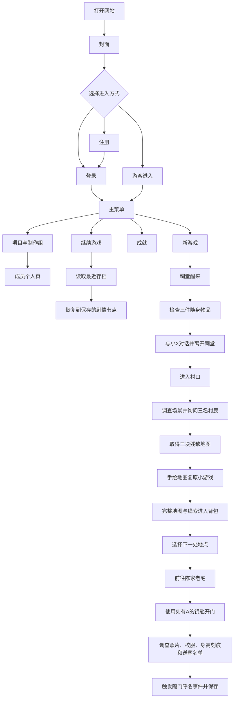

# 《白灯客》网页交互故事需求文档（PRD V1）

> 文档范围：第一周版本

## 一、Version 1 约束

1. **至少完成 20% 故事**
   - 以故事大纲“探索流程”的 14 个阶段为计算口径，V1 完成前 3 个阶段：序章“祠堂醒来”、中枢“村口开放”、A 线一“陈家老宅”，完成度为 3/14，约 21.4%。
   - “完成”指剧情可从头连续游玩，调查、选择、小游戏、状态变化和存档均可实际操作，不以静态文案或未连接页面计入。
2. **不少于 8 个独立 HTML 页面**
   - 至少包含：封面、登录、注册、主菜单、游戏、成就、制作组介绍、项目介绍。
   - 每位成员还需有独立个人页；成员页不得只用同一页切换姓名来重复计数。
3. **有小组介绍页**
   - 展示小组名称、项目分工、成员入口和联系方式（只放适合公开的信息）。
4. **每位成员有个人页**
   - 至少展示姓名、分工、完成内容和个人简介，并能返回制作组页。
5. **有登录页和注册页**
   - V1 为纯前端课程演示，不接入真实后端；账户和进度只保存在当前浏览器。
   - 页面必须明确提示用户不要填写真实密码或敏感信息。
6. **完成基本站点架构**
   - 封面、账户、主菜单、游戏、成就和介绍页面之间可正常导航，不存在死链。
7. **HTML、CSS 和目录书写规范**
   - 首页固定命名为 `index.html`；使用语义化标题、列表、表单、按钮和链接。
   - 样式使用外部 CSS，类名含义清楚；不把全部样式或脚本堆在单个 HTML 文件中。
   - 图片和音频按用途分类，尺寸与格式适合网页；所有源文件开头用中文注释说明用途。
8. **展示与兼容要求**
   - 文字适合快速扫描，不出现连续占满屏幕的大段文本。
   - V1 至少验收最新版 Chrome、Edge，以及 390px 宽手机视口；核心流程不依赖鼠标悬停。

### V1 范围边界

- 本周实现 1 个小游戏：手绘地图复原。
- 成就系统在 V1 完成最小可用版本，至少能展示并解锁 1 项成就。
- 第二个小游戏、完整证据链、全部身份反转、多结局和发布为 App 属于后续版本，本周只保留清晰的扩展位置，不制作空壳功能冒充完成。

---

## 二、产品目标

### 2.1 产品定义

《白灯客》是一款预计游玩约 3 小时的网页交互悬疑游戏。玩家阅读剧情、调查场景、收集线索并作出选择，逐步确认主角的身份和石涧村“借灯”现象背后的真相。玩家保留或删去的证据会在完整版本中导向不同结局。

V1 只讲到陈家老宅。玩家在祠堂失忆醒来，跟随小X进入村口，询问村民并复原残缺地图，随后使用刻有“A”的钥匙进入老宅。这个范围既建立“我是谁”的谜题，也展示一次完整的“阅读—探索—选择—小游戏—状态变化—存档”循环。

### 2.2 核心体验

阅读剧情 → 探索场景 → 调查对象或与人物对话 → 获得线索 → 作出选择 → 更新状态 → 进入新剧情或小游戏 → 保存进度

任何新需求都要回答一个问题：它是否帮助玩家阅读、调查、选择或理解选择造成的变化。不能说明价值的功能不进入 V1。

### 2.3 V1 可交付结果

玩家能够从封面以注册用户或游客身份进入主菜单，开始一局新游戏，连续完成祠堂、村口和陈家老宅三个阶段，完成手绘地图复原，查看背包中的地图与线索，保存后刷新页面并继续游戏。玩家还可以从主菜单查看成就、项目介绍、制作组和成员页面。

---

## 三、详细用户流程

补充规则：如果没有存档，“继续游戏”必须置灰并说明原因；如果存档损坏，系统要给出可见提示，并允许玩家返回主菜单或新建存档。

---

## 四、功能地图

1. **入口与账户**
   - 游戏封面
   - 登录
   - 注册
   - 游客进入
2. **主菜单与导航**
   - 新游戏
   - 继续游戏
   - 成就入口
   - 项目、制作组与成员入口
   - 页面返回与退出本局
3. **剧情**
   - 文本与角色对话展示
   - 剧情节点切换
   - V1 三阶段剧情内容
4. **探索**
   - 场景展示
   - 可交互对象和人物
   - 调查反馈
   - 背包与线索记录
5. **选择与状态**
   - 选项展示
   - 玩家输入
   - 剧情标记、线索和进度更新
   - 条件分支
6. **Mini-game**
   - 手绘地图复原
   - 完成判定与结果回写
7. **存档**
   - 保存当前状态
   - 恢复最近状态
   - 异常存档提示
8. **成就**
   - 成就列表
   - 锁定、解锁状态
   - V1 至少 1 项可解锁成就
9. **介绍**
   - 项目介绍
   - 制作组介绍
   - 成员个人页
10. **全局体验**
    - 响应式布局
    - 图片与音频控制
    - 操作反馈和错误提示

### 完整性判断

原功能地图的剧情、探索、选择、小游戏和存档主链基本正确，但缺少注册、游客进入、主菜单、成就、背包/线索记录、响应式与异常反馈；“成员页面”和“成员细节”也没有说明是团队总览还是个人页。以上缺口已补齐。

V1 功能地图现已覆盖第一周约束和首周用户流程。完整项目仍需在后续版本加入第二个小游戏、证据组合与删改、多结局判定、完整成就规则及 App 发布，这些不计入本周完成量。

---

## 五、需求列表
优先级说明：P0 为 V1 验收必须完成；P1 为课程最终必做、V1 先交付最小版本；P2 为内容展示项，不阻断游戏主流程，但仍应在第一周完成页面。

| ID | 模块 | 功能 | 优先级 | V1 交付 |
| --- | --- | --- | --- | --- |
| R01 | 入口 | 游戏封面 | P0 | 完整 |
| R02 | 账户 | 注册 | P0 | 本地演示版 |
| R03 | 账户 | 登录 | P0 | 本地演示版 |
| R04 | 账户 | 游客进入 | P0 | 完整 |
| R05 | 全局 | 主菜单与全站导航 | P0 | 完整 |
| R06 | 存档 | 新游戏与继续游戏 | P0 | 完整 |
| R07 | 剧情 | 基础剧情系统 | P0 | 支持 V1 内容 |
| R08 | 剧情 | V1 三阶段剧情 | P0 | 完整 |
| R09 | 探索 | 场景调查 | P0 | 祠堂、村口、老宅 |
| R10 | 探索 | 人物对话 | P0 | 小X与三名村民 |
| R11 | 全局 | 选择与状态更新 | P0 | 支持 V1 分支 |
| R12 | 探索 | 背包与线索记录 | P0 | 支持 V1 物品 |
| R13 | Mini-game | 手绘地图复原 | P0 | 完整 |
| R14 | 存档 | 保存游戏状态 | P0 | 单个最近存档 |
| R15 | 存档 | 恢复与异常处理 | P0 | 单个最近存档 |
| R16 | 成就 | 成就查看与解锁 | P1 | 至少 1 项 |
| R17 | 介绍 | 项目介绍 | P2 | 完整页面 |
| R18 | 介绍 | 制作组介绍 | P0 | 完整页面 |
| R19 | 介绍 | 成员个人页 | P0 | 每人 1 页 |
| R20 | 全局 | 响应式与多媒体展示 | P0 | 核心页面 |
| R21 | 全局 | 操作反馈与错误提示 | P0 | 核心操作 |

### 覆盖关系检查

- 约束 1“至少 20% 故事”由 R07—R13 覆盖。
- 约束 2“不少于 8 个页面”由 R01—R06、R16—R19 覆盖。
- 约束 3—4“小组与成员介绍”由 R18—R19 覆盖。
- 约束 5“登录和注册”由 R02—R04 覆盖。
- 约束 6“基本站点架构”由 R05—R06 覆盖。
- 约束 7—8“代码规范、视觉与兼容”由 R20—R21 及文件组织规范共同覆盖。

---

## 六、需求详情

### R01 游戏封面

**功能描述**

展示游戏名称、核心视觉和“进入”按钮，让玩家明确进入的是一款悬疑交互故事。封面不得提前泄露 A、B 与白灯客的身份关系。

**实现简述**

使用 `index.html` 作为唯一主页，背景图与标题样式放在独立 CSS 文件中。“进入”跳转到登录/注册/游客选择区域或登录页。背景图提供压暗遮罩，保证文字对比度。

**验收方式**

- 直接打开站点根路径能看到封面，无控制台报错或资源 404。
- “进入”可通过鼠标点击和键盘操作，跳转目标正确。
- 在 390px 和桌面视口下，标题、按钮都不溢出或遮挡。

### R02 注册

**功能描述**

玩家可创建仅用于本机演示的账户。表单至少包含用户名、演示密码、确认密码和同意本地存储提示。

**实现简述**

前端校验必填、用户名长度、密码长度和两次密码一致性。账户标识保存在 `localStorage`；密码只保存摘要，不保存明文。页面明确说明这不是线上账户系统，不应填写真实密码。

**验收方式**

- 合法输入可注册，并跳转到登录页或自动进入主菜单。
- 用户名为空、密码过短或两次密码不一致时，表单旁显示具体原因，不提交数据。
- 已存在的用户名不可重复注册，页面给出可见提示。

### R03 登录

**功能描述**

已注册的本地演示账户可登录，并读取该账户的游戏进度。

**实现简述**

对输入执行与注册页一致的标准化和摘要比对。登录成功后写入本地会话标识；失败时只提示“用户名或演示密码不正确”，不暴露存储细节。

**验收方式**

- 正确账户能进入主菜单，刷新后仍能识别当前会话。
- 错误账户信息不能进入主菜单，并显示错误提示。
- 存储不可用或数据损坏时，页面明确说明本地登录失败，并提供游客入口。

### R04 游客进入

**功能描述**

不注册的玩家也能体验全部 V1 剧情和小游戏，并拥有独立的游客存档。

**实现简述**

建立固定的游客会话和游客存档键。进入前提示游客进度只保存在当前浏览器，清理浏览器数据后无法恢复。

**验收方式**

- 不填写账户信息即可进入主菜单并开始游戏。
- 游客刷新页面后可以继续最近进度。
- 游客数据不覆盖已注册账户的数据。

### R05 主菜单与全站导航

**功能描述**

主菜单提供新游戏、继续游戏、成就、项目介绍和制作组入口。介绍页和成员页应能返回上一级或主菜单。

**实现简述**

各页面使用语义化链接完成基础跳转，JS 只负责“继续游戏”是否可用等状态。当前页面在导航中有明确标识，避免用户迷路。

**验收方式**

- 从主菜单能到达所有功能页，并能返回，不出现死链。
- 无存档时“继续游戏”不可触发，旁边说明“暂无存档”。
- 仅用键盘 Tab 和 Enter 也能完成主要导航。

### R06 新游戏与继续游戏

**功能描述**

“新游戏”创建初始状态并从祠堂开始；“继续游戏”从最近一次有效存档恢复。

**实现简述**

新游戏调用统一的初始状态工厂。若已有存档，覆盖前弹出确认框；继续游戏先校验存档版本和必要字段，再进入对应剧情节点。

**验收方式**

- 首次点击新游戏进入祠堂醒来节点。
- 已有进度时点击新游戏会先询问是否覆盖，取消后原存档保持不变。
- 继续游戏能回到保存节点，已获得物品和选项状态一致。

### R07 基础剧情系统

**功能描述**

统一展示场景名、叙述、说话人、对白和选项，并根据节点关系推进剧情。

**实现简述**

剧情内容与渲染逻辑分离。每个节点至少包含唯一 ID、文本、可选目标节点、进入条件和状态效果；渲染模块只读取数据，不把大量剧情写进事件监听器。

**验收方式**

- 从 V1 起点可连续推进到结尾，节点顺序符合大纲。
- 刷新、快速连续点击或返回页面不会重复发放同一件关键物品。
- 遇到不存在的节点 ID 时停止推进，显示错误和返回主菜单入口，而不是白屏。

### R08 V1 三阶段剧情

**功能描述**

实装故事大纲前 3 个阶段：祠堂醒来、村口中枢、陈家老宅。内容应埋下三件随身物品、小X的可疑表现、A 的旧家线索和第一次“隔门呼名”惊吓，但不揭露三重身份答案。

**实现简述**

按“序章、村口、老宅”拆成独立剧情数据文件或模块。每阶段设置开始、关键交互完成和结束三个进度标记，便于存档和验收。

**验收方式**

- 三阶段均可正常进入并完成，合计覆盖大纲探索流程的 3/14。
- 玩家在祠堂取得三件物品，在村口取得地图碎片，在老宅调查四类关键线索。
- V1 结尾停在隔门呼名事件之后，有明确的“第一周内容结束”提示。

### R09 场景调查

**功能描述**

玩家可在祠堂、村口和陈家老宅中调查有意义的对象，已调查对象有视觉变化或文字标记。

**实现简述**

场景热点使用按钮或带可访问名称的交互元素，不使用只有坐标、无法聚焦的空标签。调查结果写入状态，关键对象全部调查后才开放下一节点。

**验收方式**

- 每个热点可点击、可键盘聚焦，并给出与对象对应的反馈。
- 已调查对象不会反复发放线索，但允许重新阅读说明。
- 未完成必要调查就离开时，系统指出还缺少什么，不让流程无提示卡死。

### R10 人物对话

**功能描述**

玩家可与小X及村口三名村民对话。不同人物提供互相矛盾的信息，建立 A、B、苏禾和白灯客四个名字的悬念。

**实现简述**

对白沿用剧情节点结构，记录每个人物是否已完成首次对话。三名村民分别发放一块地图碎片或通往碎片的线索，小X的补充对白由调查进度触发。

**验收方式**

- 三名村民可按任意顺序交谈，均不会阻断流程。
- 每段对白能清楚区分说话者，重复交谈时不重复首次奖励。
- 集齐三块碎片后自动或明确提示开启地图小游戏。

### R11 选择与状态更新

**功能描述**

玩家的选择会改变对白、调查顺序或小X的回应，并留下后续可读取的状态标记。

**实现简述**

选项使用唯一 ID，并把影响写成有限、明确的状态字段。V1 至少保留一项与小X信任相关的选择标记，为后续剧情使用；本周不伪造尚未实现的结局分支。

**验收方式**

- 作出选择后，当前节点只结算一次，界面展示对应反馈。
- 重新读取存档后，已作选择和相关对白保持一致。
- 代码中能从选项 ID 追踪到具体状态变化，不依赖按钮显示文字判断逻辑。

### R12 背包与线索记录

**功能描述**

背包集中展示三件随身物品、地图碎片、完整地图和老宅线索，玩家可随时查看已获得内容。

**实现简述**

物品数据包含唯一 ID、名称、图片、简述、来源和获取状态。背包使用遮罩层或游戏页内面板，不为每件物品创建独立 HTML 页面。

**验收方式**

- 物品获得后立即出现在背包，未获得物品不提前泄露内容。
- 点击物品能查看清晰图片和说明，关闭后回到原剧情节点。
- 保存并刷新后，背包内容与保存前一致。

### R13 手绘地图复原

**功能描述**

玩家集齐三块残缺地图后，通过拖动或点击交换碎片完成复原。成功后获得完整村庄地图并开放陈家老宅。

**实现简述**

使用 HTML 元素、CSS 和原生 JS 实现，不要求 Canvas。碎片具有固定正确位置；同时提供点击选中再交换的操作，保证触屏和键盘可用。完成结果写入游戏状态。

**验收方式**

- 未集齐三块碎片不能开始，并显示缺失数量。
- 鼠标、触屏和键盘至少各有一种可完成拼图的方式。
- 拼对后只结算一次，背包新增完整地图，刷新或读档不会要求重复完成。

### R14 保存游戏状态

**功能描述**

玩家可保存最近进度。存档至少包括账户/游客标识、当前节点、阶段进度、选择标记、已调查对象、背包、小游戏结果、成就、更新时间和数据版本。

**实现简述**

使用 `localStorage` 保存一个结构化对象，注册用户与游客使用不同键名。保存入口放在游戏界面固定位置，成功或失败都显示结果。

**验收方式**

- 在祠堂、村口和老宅各保存一次，存储内容均能对应当前状态。
- 点击保存后显示时间和“保存成功”；写入失败时显示原因，不得仍提示成功。
- 多次点击保存不会产生相互冲突的重复记录。

### R15 恢复与异常处理

**功能描述**

系统可读取最近存档；遇到缺字段、无法解析或版本不兼容的存档时，不进入错误状态。

**实现简述**

读取时先捕获解析错误，再校验 `schemaVersion`、当前节点和必要字段。无效数据保留到用户确认后再清除，页面提供“返回主菜单”和“新游戏”两条恢复路径。

**验收方式**

- 正常存档恢复后，剧情节点、背包、调查状态和拼图结果一致。
- 手动写入损坏数据进行测试时，页面显示“存档无法读取”，控制台记录具体错误。
- 未经玩家确认，不自动覆盖或删除损坏存档。

### R16 成就查看与解锁

**功能描述**

成就页展示成就名称、说明和锁定状态。V1 至少实现一项能通过实际游玩解锁的成就，例如完成地图复原。

**实现简述**

成就采用唯一 ID，并由明确事件触发。解锁状态写入对应用户或游客存档；未解锁成就可隐藏条件，但不能用不可实现的假进度误导玩家。

**验收方式**

- 新游戏开始时成就为锁定状态。
- 完成指定条件后出现一次解锁提示，成就页同步更新。
- 刷新或读档后已解锁状态保留，不重复弹出解锁通知。

### R17 项目介绍

**功能描述**

介绍游戏类型、故事背景、核心玩法、V1 范围和隐私说明，不剧透后期身份反转。

**实现简述**

制作独立项目介绍页，使用短段落、分级标题和列表组织内容，并链接到制作组页和主菜单。

**验收方式**

- 页面内容与本 PRD 一致，没有把后续功能写成已完成。
- 文本无超长行或整屏大段，移动端无需横向滚动。
- 返回主菜单和前往制作组的链接可用。

### R18 制作组介绍

**功能描述**

展示小组名称、成员、分工和每位成员个人页入口。

**实现简述**

成员以卡片或列表展示，每张卡片包含姓名、主要分工和详情链接。只公开组员同意展示的信息。

**验收方式**

- 实际成员全部出现，姓名和分工准确。
- 每个成员入口都指向对应个人页，不存在占位链接。
- 页面可返回项目介绍或主菜单。

### R19 成员个人页

**功能描述**

每位成员拥有独立 HTML 页面，展示个人简介、项目分工、实际完成内容和返回入口。

**实现简述**

成员页共享同一份 CSS，但保留独立文件。文件名使用小写英文或姓名拼音，不用空格和“最终版”等临时字样。

**验收方式**

- 成员人数为 N 时，存在 N 个可独立访问的成员页。
- 每页内容对应本人，不复制同一段占位文案。
- 所有页面的返回链接、标题层级和移动端布局正常。

### R20 响应式与多媒体展示

**功能描述**

界面在桌面和手机上都能阅读与操作；图片和可选音频服务于雨夜山村氛围，但不妨碍剧情信息获取。

**实现简述**

使用相对尺寸、弹性布局和必要的媒体查询。图片设置合理尺寸与替代文本；音频默认不强制自动播放，提供播放、暂停和音量控制。

**验收方式**

- 在 390px、768px 和 1280px 宽度检查封面、主菜单、游戏、成就和介绍页，无横向滚动或按钮遮挡。
- 图片加载失败时仍能从文字理解页面用途。
- 静音或音频加载失败不阻断剧情和小游戏。

### R21 操作反馈与错误提示

**功能描述**

保存、登录、注册、调查、获得物品、解锁成就和小游戏完成等关键动作都有可见反馈；失败必须说明发生了什么以及玩家可以怎么做。

**实现简述**

复用轻量提示区域展示成功、警告和错误状态。开发期在控制台记录包含模块名和错误对象的技术信息，界面显示玩家可理解的说明；不使用空 `catch` 或只写 `console.log` 后继续假装成功。

**验收方式**

- 逐项触发成功和失败路径，界面反馈与实际状态一致。
- 资源缺失、存档损坏或节点无效时不白屏，且能返回安全页面。
- 浏览器控制台没有未处理异常；测试产生的错误有明确模块来源。

---

## 七、项目文件组织结构建议(未定)

### 组织原则

1. **一个功能放在一个明确位置。** 剧情数据不写进 HTML，存档逻辑不混入小游戏文件，成员资料不混在游戏脚本中。
2. **第一周不搭建多余工程。** 使用原生 HTML、CSS 和 JavaScript 即可；没有构建需求时不引入框架、打包器或复杂服务端。
3. **文件名统一。** 目录和代码文件使用小写英文及连字符，主页只用 `index.html`；素材名体现“场景/角色/用途”，避免 `1.png`、`new-final.js`。
4. **入口脚本显示关键信息。** 开发模式启动时在控制台打印当前版本、运行模式、剧情起始节点和存档键；发生错误时打印具体模块与原因，不能静默失败。
5. **每个源文件先写中文用途注释。** HTML 使用 `<!-- ... -->`，CSS 使用 `/* ... */`，JavaScript 使用 `// ...`，说明该文件负责什么。图片、音频等二进制素材不适用此规则。
6. **不要用双份文件长期维护同一内容。** 当前中文文件可在提交后迁入 `docs/` 并统一链接；如果暂时保留原文件名，就不要再建立内容相同的副本。

### 页面数量验收示例

不计算成员页时，上述结构已有 8 个独立页面：封面、登录、注册、主菜单、游戏、成就、项目介绍、制作组介绍。再加每位成员各 1 个个人页，能够稳定满足“≥8 个页面”和“每位成员个人页”两项约束，而不需要用空白页面凑数。
