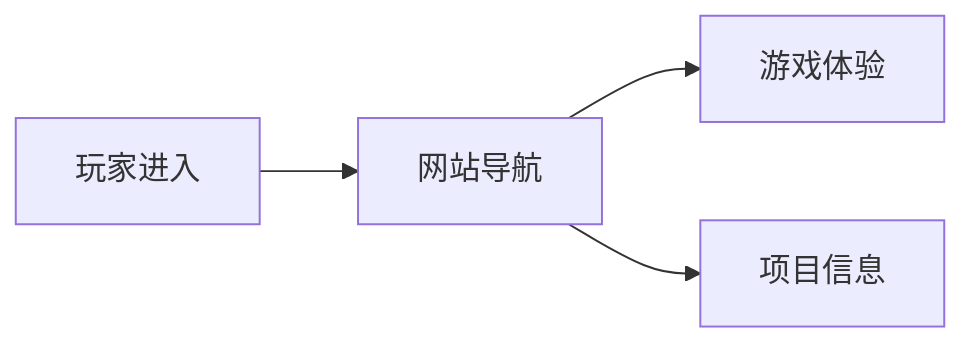
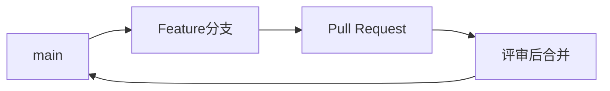

# 《白灯客》网页交互故事项目文档 V1

> 文档性质：项目说明与开发执行约定  
> 项目周期：课程规定的完整三周  
> 开发方式：轮值角色、PRD-subPR 驱动、GitHub Flow  
> 当前产品范围：需求文档 PRD V1

## 一、项目是什么

《白灯客》是一款运行在浏览器中的网页交互悬疑游戏。玩家以一名失忆者的视角进入石涧村，通过阅读剧情、调查场景、与人物对话、收集线索和完成小游戏，逐步确认自己的身份，并追查雨夜“借灯”现象背后的真相。

完整故事围绕 A、B、白灯客三个名字展开。它们并非三个独立人物，而是主角在不同阶段使用的身份。游戏前半段让玩家怀疑村中有鬼，中段解释各种异象如何被人为制造，后半段再让玩家面对主角参与恐吓、隐瞒死亡和删改证据的事实。最终结局取决于玩家保留或删除了哪些证据。

V1 交付大纲探索流程中的前 3 个阶段：

1. 序章“祠堂醒来”；
2. 中枢“村口开放”；
3. A 线一“陈家老宅”。

按完整大纲的 14 个阶段计算，V1 完成度为 3/14，约 21.4%，满足第一周至少完成 20% 故事的要求。

## 二、项目来源与背景

### 2.1 故事来源

项目改编自小组原创悬疑故事《白灯客》。故事发生在半废弃的南方矿山村落“石涧村”。村中流传着一条禁忌：死者会在雨夜借来一盏没有火焰的白灯，活人若开门回应，便会被借走脸。

这套民俗既是恐怖氛围的来源，也是叙事机关。白灯、广播童谣、湿脚印和墙上姓名在故事中都有物理成因，真正推动悲剧的是集团、村民、父亲和主角各自作出的选择。白灯象征的不是超自然力量，而是人借传说掩盖责任。

### 2.2 课程背景

本项目用于三周网站开发课程实践，需要同时完成网页结构、交互逻辑、团队协作和版本管理训练。课程与 V1 需求对交付物提出了以下硬性约束：

- 完成至少 20% 的故事内容，并且能够连续游玩；
- 建立不少于 8 个独立 HTML 页面；
- 提供登录页、注册页、制作组介绍页和每位成员的独立个人页；
- 完成封面、账户、主菜单、游戏、成就和介绍页面之间的站点架构；
- 使用规范的 HTML、外部 CSS 和分模块 JavaScript；
- 兼容最新版 Chrome、Edge 和 390px 宽的手机视口；
- 所有失败都必须给出可见反馈，禁止无提示卡死、假成功和空白页。

### 2.3 项目目标

V1 要证明这套故事能够以网页形式“玩起来”。玩家应当能够从封面进入，以本地账户或游客身份开始游戏，连续完成阅读、探索、选择、地图复原、状态更新和存档，再从主菜单查看成就与项目资料。

完整项目的目标是在三周内逐步补齐 14 个探索阶段、第二个小游戏、证据组合与删改、多结局判定和最终发布。后续内容只有在实际接入主流程并通过验收后，才能计入完成量。

## 三、网站内容与范围

### 3.1 网站结构

不计算成员个人页，基础站点已经包含封面、登录、注册、主菜单、游戏、成就、项目介绍和制作组介绍 8 个独立页面。本项目共有 5 名成员，再增加罗晨菲、杨梦、于知让、高冰轩、卢正松各自的个人页后，计划页面总数为 13 页。成员页不能用同一页面切换姓名来重复计数，也不能以空白页凑数。

### 3.2 V1 用户流程

没有存档时，“继续游戏”保持不可用，并解释“暂无存档”。存档损坏时，系统保留原数据，明确提示无法读取，同时提供返回主菜单和新建存档两条安全路径。

### 3.3 V1 功能清单

| 模块 | V1 内容 | 完成判断 |
| --- | --- | --- |
| 入口与账户 | 封面、注册、登录、游客进入 | 三种进入方式都能到达主菜单；页面提示不要填写真实密码 |
| 主菜单 | 新游戏、继续游戏、成就、项目介绍、制作组入口 | 所有链接可达、可返回，无死链 |
| 剧情 | 祠堂、村口、陈家老宅三个阶段 | 可以从开场连续推进到隔门呼名事件 |
| 探索与对话 | 场景热点、小X、三名村民、老宅线索 | 可点击、可键盘操作；奖励只结算一次 |
| 选择与状态 | 选项 ID、剧情标记、小X信任标记 | 选择可改变反馈，读档后状态一致 |
| 背包与线索 | 三件随身物品、地图碎片、完整地图、老宅线索 | 已获得内容可查看，未获得内容不剧透 |
| Mini-game | 手绘地图复原 | 鼠标、触屏、键盘均有可完成方式，结果只结算一次 |
| 存档 | 单个最近存档、恢复、版本校验、异常提示 | 刷新后可恢复节点、物品、选择、调查和小游戏状态 |
| 成就 | 成就列表及至少 1 项实际可解锁成就 | 完成条件后提示一次，刷新后仍保持解锁 |
| 介绍 | 项目、制作组、每位成员个人页 | 内容真实、入口有效、适合公开 |
| 全局体验 | 响应式、多媒体控制、操作反馈 | 390px、768px、1280px 下可读可操作；无未处理异常 |

### 3.4 V1 明确不做

- 第二个小游戏；
- 完整证据链与证据删改界面；
- A、B、白灯客身份关系的完整揭示；
- 小X终局对峙和多结局；
- 真实后端、跨设备账户同步与服务器数据库；
- 为后续版本预先制作不可操作的菜单、进度条或假功能。

## 四、技术方案

### 4.1 开发与运行平台

| 项目 | 方案 |
| --- | --- |
| 开发平台 | 常规代码编辑器、Git、GitHub；成员可使用 Windows、macOS 或 Linux |
| 前端技术 | 原生 HTML5、CSS3、JavaScript，不引入没有实际需要的框架和打包器 |
| 运行方式 | 静态站点，通过本地 HTTP 服务或部署后的站点地址访问 |
| 运行平台 | 最新版 Chrome、Edge；桌面端与移动端浏览器视口 |
| 数据保存 | 浏览器 `localStorage`，注册用户与游客使用不同存储键 |
| 版本管理 | GitHub Flow，`main` 为唯一长期分支，功能在短期 Feature 分支开发 |

### 4.2 模块边界

模块按职责拆分：剧情内容放在数据文件中，剧情引擎只负责渲染和推进；存档模块只负责保存、读取、校验和报错；小游戏完成后通过统一状态接口回写结果；背包只读取物品数据和获得状态。不得把全部剧情、样式和交互塞进 `game.html`，也不得让小游戏直接修改其他模块的内部数据。

### 4.3 数据与状态

单个最近存档读取时必须先处理解析错误，再检查版本、必要字段和剧情节点。保存失败不能继续显示“保存成功”。剧情节点不存在、资源丢失、存储不可用等问题都要在界面中说明发生了什么，并在控制台打印模块名和原始错误，禁止空 `catch` 和静默降级。

### 4.4 页面与代码规范

- 首页固定为 `index.html`；目录和代码文件使用小写英文及连字符；
- 页面使用语义化标题、列表、表单、按钮和链接；
- 样式写入外部 CSS，脚本按功能域拆分；
- 每个 HTML、CSS、JavaScript 文件开头用中文注释说明用途；
- 所有核心操作支持键盘，不把鼠标悬停作为唯一触发方式；
- 图片提供替代文本，音频默认不强制自动播放，并提供播放、暂停和音量控制；
- 开发入口启动时打印当前版本、运行模式、项目绝对路径、剧情起始节点和存档键；
- 控制台不得存在未处理异常，资源请求不得出现无说明的 404。

## 五、PRD-subPR 驱动的开发流程

### 5.1 基本原则

项目不采用固定岗位配合固定日期的瀑布式安排。每一代从当时的 `main` 状态出发，由当代项目经理组织产生下一代 PRD；需求经过评审后被拆成可独立开发、独立测试、独立验收的 subPR。全部 subPR 落地，当前代才结束，随后立即交接并轮换角色。

这里的 subPR 指一个版本 PRD 下的模块化交付单元。每个 subPR 对应一个 Feature 分支和一个合并请求，不是把无法运行的大改动切成若干没有验收价值的小提交。

### 5.2 一代版本的完整流程

### 5.3 GitHub Flow 约定

- `main` 始终保持可运行、可演示，禁止直接提交功能代码；
- 每个 subPR 从最新 `main` 创建短期分支，建议命名为 `feature/v版本-需求ID-简述`；
- 一个分支只服务一个清晰需求，提交记录说明实际变化；
- 技术评审前先拉取最新 `main`，解决冲突并重新完成自测；
- PR 描述必须关联需求 ID、验收条件、测试证据、界面截图和已知问题；
- 合并前同时满足技术级测试和需求级验收；
- 合并后删除已完成的 Feature 分支，全部 subPR 完成后为版本打标签；
- 不建立长期 `dev` 分支，不允许在个人分支积压到最后一天再一次性合并。

### 5.4 subPR 最小信息

每个 subPR 在开始开发前必须写清：

| 字段 | 内容 |
| --- | --- |
| 需求来源 | 对应 PRD 版本、需求 ID 和原文链接 |
| 交付范围 | 本 PR 负责什么，不负责什么 |
| 验收条件 | 可被实际操作和复现的通过标准 |
| 依赖关系 | 必须先合并的 subPR；没有则写“无” |
| 轮值人员 | 本轮开发者、技术负责人、产品经理 |
| 测试证据 | 测试步骤、结果、截图或录屏 |
| 风险与遗留 | 已知限制，不得隐藏失败路径 |

需求评审可以增、减、删、改、拆分或合并需求，但修改必须回写到当代 PRD 和 subPR 清单，不能只留在聊天记录里。

## 六、轮动角色与详细分工

### 6.1 角色职责

| 轮值角色 | 开发前 | 开发中 | 合并与交接 |
| --- | --- | --- | --- |
| 项目经理 | 汇总上一代结果；起草下一代 PRD；主持需求评审；确定 subPR 边界与依赖 | 跟踪需求状态；处理范围冲突；组织必要的需求变更 | 确认本代需求全部落地；整理版本记录、遗留问题和下一代输入 |
| 产品经理 | 检查用户流程、故事边界和验收标准；防止提前剧透或虚报完成 | 回答需求问题；检查实现是否偏离玩家体验 | 按 PRD 做需求级验收；通过后允许合并，不通过则写明差距 |
| 技术负责人 | 确定模块边界、接口和分支策略；识别技术依赖 | 审查关键实现；协调冲突；保证 `main` 可运行 | 拉取最新 `main` 做技术级测试；检查代码、兼容性、错误反馈和测试证据 |
| 模块负责人/开发者 | 领取一个可独立交付的 subPR；确认范围与依赖 | 在 Feature 分支实现、自测、记录问题；及时同步上游变化 | 修复评审问题；补齐 PR 说明；完成交接材料 |
| 内容与视觉责任人 | 核对大纲、剧透边界和素材需求；统一画面基调 | 编写或校对剧情数据，制作和压缩素材，检查文字可读性 | 核对成品内容与素材授权信息，不让占位素材进入发布版 |
| 测试记录人 | 根据验收条件准备场景、设备和异常数据 | 记录成功与失败路径，复测修复项 | 汇总回归结果，确保问题有负责人、有状态、有复现步骤 |

这些角色描述的是一轮中必须有人承担的责任，不代表永久岗位。每一代的项目经理、产品经理、技术负责人和测试记录人都记录在对应版本 PRD、GitHub Project/Issue 和 PR 中，保证轮换后仍能追溯。V1 的模块负责人则以本文件下一节为执行基线。

### 6.2 轮动规则

1. **以代为单位轮动。** 一代需求全部落地并打版本标签后，项目经理、产品经理、技术负责人和模块负责人进行交接；下一代由新的人员接任。
2. **完成即换代。** 轮动不等待固定日期。如果本代提前完成，立即进入下一代需求评审；如果未通过验收，本代继续修正，不能仅因周次变化宣布完成。
3. **模块在换代时轮动。** V1 先按已确认的实际分工开发。进入下一代时，成员优先承担与上一代不同的功能域；变更后的负责人必须写入新一代 PRD 和 subPR，完成交接后才生效。
4. **作者不能独自验收自己。** subPR 开发者不能同时作为该 PR 唯一的技术审查人或需求验收人。人员较少时可以兼任其他角色，但至少要保留一次他人复核。
5. **轮换不切断责任。** 前任需要交付 PRD、已合并 subPR、测试记录、遗留问题、风险和最新 `main` 状态；继任者确认后再开始下一代。
6. **角色冲突公开处理。** 产品目标与技术代价冲突时，由项目经理组织评审并记录取舍。任何人都不能用口头决定绕过 PRD 或合并检查。

### 6.3 V1 实际模块分工

| 成员 | 负责模块 | 对应需求 | V1 主要交付 |
| --- | --- | --- | --- |
| 罗晨菲 | 全局、存档 | R05、R06、R11、R14、R15、R20、R21 | 主菜单与全站导航；新游戏和继续游戏；统一状态更新；存档保存、恢复、版本校验与异常提示；响应式、多媒体控制和全局操作反馈 |
| 杨梦 | 入口 | R01 | `index.html` 游戏封面、核心视觉与进入按钮；桌面端和移动端入口适配；保证入口不剧透且无资源 404 |
| 于知让 | 账户、剧情 | R02、R03、R04、R07、R08 | 本地注册、登录和游客会话；基础剧情引擎；祠堂、村口、陈家老宅三阶段剧情数据与推进逻辑 |
| 高冰轩 | Mini-game、介绍 | R13、R17、R18、R19 | 手绘地图复原及结果回写；项目介绍、制作组介绍和 5 个成员个人页；汇总各成员确认后的公开资料 |
| 卢正松 | 成就、探索 | R09、R10、R12、R16 | 祠堂、村口、老宅热点调查；小X和三名村民对话；背包与线索记录；至少 1 项可实际解锁的成就 |

每位负责人对自己模块的实现、自测、PR 说明和评审修正负责。跨模块接口由相关负责人共同确认：于知让提供剧情节点和账户会话，于知让与卢正松对齐调查、对话和线索效果，卢正松与高冰轩对齐地图碎片及成就事件，高冰轩把小游戏结果交给罗晨菲的统一状态与存档接口保存。介绍页由高冰轩负责集成，但每位成员需要提供并确认本人简介、分工和实际完成内容。

当前分工不改变互审原则。开发者不能成为自己 subPR 的唯一技术审查人或需求验收人；当代技术负责人和产品经理按轮值安排进行跨模块复核。

### 6.4 模块分工方式

每轮先把需求按功能域拆分，再根据依赖安排并行或串行开发：

| 功能域 | 典型 subPR | 主要接口 |
| --- | --- | --- |
| 站点与账户 | 封面、登录、注册、游客、主菜单、全站导航 | 会话标识、页面入口、存档键 |
| 剧情与探索 | 剧情数据、节点渲染、场景热点、人物对话 | `currentNodeId`、调查状态、选项效果 |
| 状态与存档 | 初始状态、保存、恢复、校验、异常处理 | 统一游戏状态与 `schemaVersion` |
| 背包与成就 | 物品展示、线索记录、成就判定 | 物品 ID、事件 ID、解锁状态 |
| Mini-game | 地图碎片交互、完成判定、无障碍操作 | 小游戏结果回写、完整地图奖励 |
| 内容与视觉 | 三阶段文本、场景图、物品图、音效、响应式样式 | 剧情数据格式、资源路径、替代文本 |
| 文档与测试 | README、成员页、验收记录、兼容性与回归测试 | PRD、subPR 清单、测试证据 |

模块边界用于降低冲突，不等于固定分人。一次轮动中，一个团队可负责若干相互关联的模块，但每个模块必须有明确负责人，不能出现“全组负责”却无人处理的情况。

## 七、完整三周计划

三周是课程交付范围，不是按小时切割的固定日程。下表规定每周结束前应达到的版本状态；周内实际产生多少代、每代由谁负责，由上一代完成情况决定。

| 周次 | 版本目标 | 主要交付 | 进入下一阶段的条件 |
| --- | --- | --- | --- |
| 第一周 | 可连续游玩的 V1 | 基础 8 页与成员页；本地账户和游客；主菜单；祠堂、村口、陈家老宅 3/14 阶段；地图复原；背包；单存档；至少 1 项成就；响应式与错误反馈 | V1 P0 全部通过；三阶段可连续游玩；刷新后可继续；无死链和未处理异常 |
| 第二周 | 中段调查版本 | 接入 A 线二、B 线一、苏禾线、白灯客线一、第一次“拆鬼”汇合及 B 线二；完善恐吓装置的触发条件、物理解释与可利用缺陷；加入第二个小游戏或等价的中段交互；扩展线索与成就 | 中段剧情可从 V1 存档继续；“借灯可人为制造”和“主角就是 B”按顺序揭示；旧存档有明确迁移或不兼容提示；技术与需求验收均通过 |
| 第三周 | 完整故事与发布版本 | 接入 A 线三、父亲与集团线、白灯客线二、苏禾之死和终局；完成证据组合/删改、对峙和多结局；全流程回归、性能与兼容测试；整理项目介绍、成员实际贡献、README 和发布材料 | 14 个阶段完整可玩；结局由实际证据状态决定；新游戏与读档均可完成全流程；所有发布文档与最终 `main` 一致 |

### 7.1 周内滚动方式

每周目标只描述必须达到的产品状态。具体开发顺序由依赖关系决定：公共状态和存档接口应先稳定，剧情、页面和素材可以并行；依赖上游接口的 subPR 必须在清单中明确标注，不能靠开发者临时猜测。

### 7.2 每周验收重点

**第一周**检查“基本可玩”：入口完整、页面数量真实、前三阶段连通、地图小游戏能完成、存档能恢复、移动端能操作。

**第二周**检查“叙事与系统扩展”：新增阶段没有打乱身份揭示顺序，恐吓装置具有清晰边界，线索状态能跨阶段保存，旧版数据不会导致白屏。

**第三周**检查“完整责任链”：证据能互相印证，删改行为真正影响结局，小X对峙具备前置条件，完整公开不是单一按钮假分支。最后完成全站回归和发布检查。

## 八、验收与质量标准

### 8.1 产品验收

- 功能必须从用户入口实际可达，不能只存在于代码中；
- 剧情、调查、选择、小游戏、状态变化和存档组成连续流程；
- 页面描述与当前版本一致，未完成功能不得写成“已上线”；
- V1 结尾明确提示第一周内容结束，但不泄露后续身份答案；
- 成员页记录每个人实际完成的内容，不复制同一段占位文案。

### 8.2 技术验收

- `main` 可直接运行，页面资源无 404，控制台无未处理异常；
- 390px、768px、1280px 三种宽度下核心页面无横向滚动、遮挡或无法点击；
- 鼠标、触屏和键盘都能完成核心流程；
- 快速连续点击、刷新、重复调查不会重复发放关键物品或成就；
- 存档损坏、版本不兼容、节点不存在、资源和音频加载失败时均有可见说明；
- 保存、登录、注册、小游戏和成就的成功提示必须与真实状态一致；
- 代码保持功能域分离，每个源文件开头有中文用途注释。

### 8.3 版本完成定义

一个 subPR 只有同时满足以下条件才算完成：

1. 实现内容与当代 PRD 和 PR 范围一致；
2. 开发者自测通过，并附可复现的测试记录；
3. 已同步最新 `main`，没有未解决冲突；
4. 技术负责人完成技术级审查；
5. 产品经理按验收条件完成需求级验收；
6. 合并后 `main` 仍可运行，相关文档已同步更新。

一个版本只有在其全部必需 subPR 合并、回归测试通过并打上版本标签后才算落地。版本号变化、角色轮动和下一代 PRD 都以这个完成定义为准，不以固定日期或口头宣布为准。

## 九、当前待确认事项

以下内容在故事大纲或团队资料中仍未定稿，不在本文中擅自补全：

- A、B、小X及团队成员的正式姓名；
- 苏禾失踪后的社会后果和对外解释；
- 石涧村的具体地域、季节、美术材料与声音规范；
- “借灯”民俗的村内来源与稳定规则；
- 各种恐吓装置的供电、触发、操作者和可被玩家利用的缺陷；
- 第二个小游戏的具体形式；
- 小X终局对峙的可玩机制和失败条件。

这些问题应进入后续版本的需求评审。确认后先更新当代 PRD，再拆成可验收的 subPR，不直接在开发分支里临时决定。
